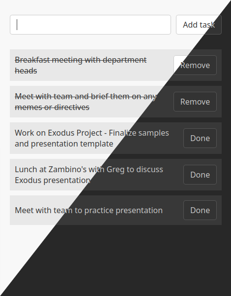

# Todoer

A new updated todo-app with an all-new codebase strictly structured according to the MVC-pattern. As before, it saves your tasks to local storage and automatically switches between light and dark theme depending on your choice in the operating system. New in the GUI is that tasks can have two states, undone and done. When done they gets striked and ready for deletion. This way you can really see your progress during the day. Also perfect when using the app as a shopping list. PWA-capabilities like installability and offline-mode are implememented as well.
